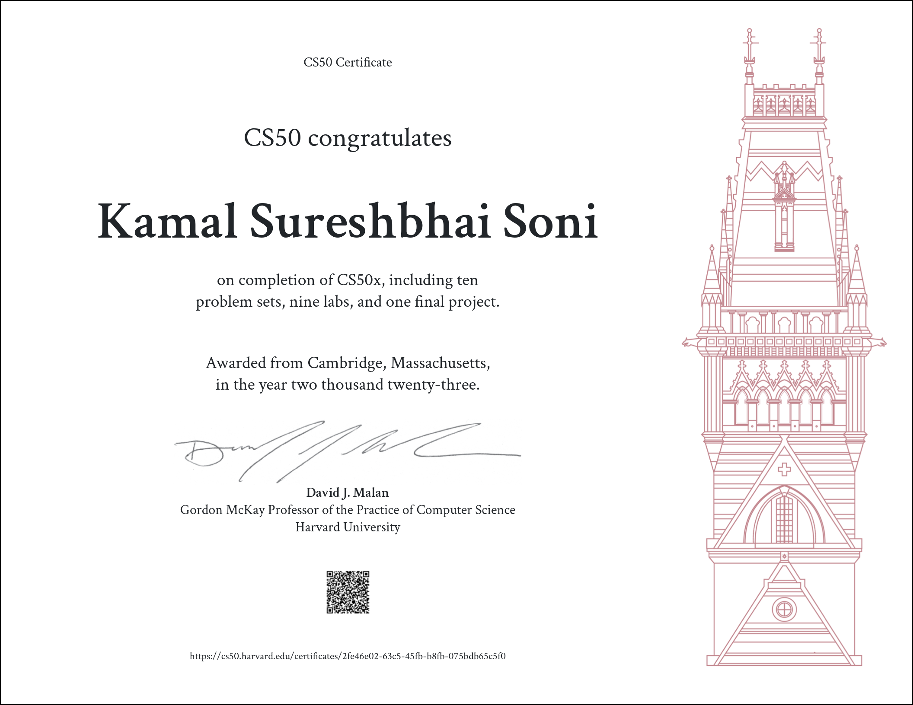

# CS50 Introduction to Computer Science

Welcome to the world of computer science through the lens of **CS50 Introduction to Computer Science**! This repository serves as a guide and resource hub for anyone interested in embarking on a journey of discovery into the fascinating realm of programming, algorithms, and problem-solving.

## About CS50

**CS50** is a renowned and dynamic introductory course offered by Harvard University that demystifies the complex world of computer science for students of all backgrounds. Led by Professor David J. Malan, this course has gained popularity for its engaging lectures, challenging problem sets, and hands-on projects that encompass a wide range of topics.

## What's Inside

In this repository, you will find:

- **Lecture Notes**: Comprehensive notes from each CS50 lecture, covering topics from basic programming concepts to advanced algorithms and data structures.

- **Problem Sets**: Solutions and explanations for the problem sets assigned during the course, providing you with a deeper understanding of the concepts learned.

- **Project Exemplars**: Inspiring project exemplars that showcase the creativity and technical skill of students in bringing their ideas to life.

- **Additional Resources**: A curated collection of additional resources, tutorials, and readings that supplement the CS50 curriculum, allowing you to explore and expand your knowledge even further.

## Getting Started

If you're new to CS50 or computer science in general, don't worry! Getting started is easy:

1. **Clone or Fork**: Clone or fork this repository to your own GitHub account to have your own copy of the resources.

2. **Navigate**: Browse the folders to access the lecture notes, problem set solutions, and project exemplars that pique your interest.

3. **Learn and Explore**: Dive into the materials at your own pace. Start with the lecture notes to grasp fundamental concepts, then challenge yourself with the problem sets and projects to solidify your understanding.

4. **Contribute**: If you've taken CS50 or have resources to share, feel free to contribute to this repository by creating pull requests. Let's collaborate and build a comprehensive learning resource for everyone!

## Acknowledgments

A special thanks to Professor David J. Malan and the entire CS50 team for creating and maintaining this incredible course, and to the dedicated students whose passion for learning has enriched the CS50 community.

 

## Get in Touch

If you have questions, suggestions, or just want to connect with fellow CS50 enthusiasts, feel free to reach out via email or social media (links provided in my GitHub profile).

Start your journey into the world of computer science with CS50! Happy coding!

---

**Disclaimer:** This repository is intended to be a supplementary resource and does not replace the official CS50 course. Make sure to enroll in the official course to fully benefit from the immersive learning experience.

